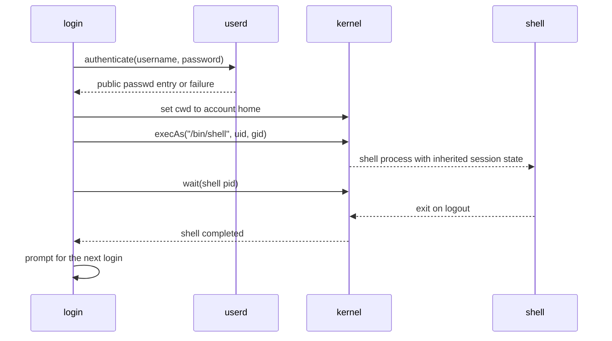

## Session Entry Point

Once required services are ready, boot starts `/bin/login`. The login process does not become the interactive shell itself: it authenticates a user and creates a shell child with that identity.



Authentication is delegated to `userd`; `login` receives only the public account record needed to set the user identity and home directory.

## Default Accounts and Homes

| Account | UID | GID | Home Directory |
| --- | ---: | ---: | --- |
| `root` | `0` | `0` | `/` |
| `rkc` | `1000` | `1000` | `/home/rkc` |

The shell prompt resolves the current UID through `userd` and renders:

```text
<user>@Rk-C:<cwd>$ 
```

The username, system name, and current working directory are highlighted in the terminal UI. Per-user command history is stored as `.history` under that account's home directory: `/.history` for `root`, and `/home/rkc/.history` for `rkc`.

## Shell Command Model

The shell maintains heap-backed buffers for line editing and command processing. An interactive line is handled in the following order:

1. Read and edit one input line.
2. Detect stdout redirection using `>`.
3. Detect a single pipeline using `|`.
4. Parse a built-in or resolve an executable under `/bin`.
5. Remove a trailing `&` marker and decide whether to wait for children.
6. Record and eventually persist command history.

| Shell Feature | Current Behavior |
| --- | --- |
| Built-ins | `help`, `cd`, `su`, `pwd`, `ticks`, `traps`, `bitmap`, `history`, `exit` |
| External command lookup | Bare commands become `/bin/<command>`; absolute executable paths are also accepted |
| Background execution | A trailing `&` creates a detached child and immediately returns the prompt |
| Pipeline | One `left | right` pipeline is supported |
| Redirection | One `command > path` stdout redirection is supported |
| Combined pipe/redirection | Not yet supported |

`login` and managed service binaries are intentionally rejected when requested directly from the shell. Servers are lifecycle-managed through `svcmgtd` rather than launched as arbitrary interactive children.

## File Descriptor Wiring

The shell implements pipeline and redirection through inherited descriptors, not command-specific output handling.

```text
command > output.txt

shell FD 1 ---- dup2(file fd, 1) ----> child FD 1 ----> output.txt
        \---- restored after exec ----> shell console output
```

```text
left | right

left FD 1  ----> pipe write end ===== pipe read end ----> right FD 0
shell FD 1 ----> restored console      shell FD 0 ------> restored console
```

The shell opens `/dev/stdout` or `/dev/stdin` to preserve its terminal descriptors, replaces the required FD using `dup2`, starts the child, then restores its own descriptor. Because child processes inherit descriptor state, programs such as `curl`, `ls`, and future commands do not need to know whether output is being redirected.

## Identity Changes Inside a Session

The built-in `su <user>` performs password authentication through `userd`. After successful authentication, the shell requests its own UID and GID change, changes cwd to the new home directory, clears the old in-memory history, and loads history for the new identity.

This behavior is intentionally different from `sudo`: `su` changes the interactive shell session, whereas privileged executable policy remains enforced independently by kernel execution restrictions and capabilities.

## Actual Interactive Session Output

The password input is intentionally not echoed. The excerpt below was produced by an actual login session and shows authentication followed by a command whose stdout is redirected through inherited FD state.

```text
login: root
password:

root@Rk-C:/$ echo redirected-output > /tmp/capture.txt
root@Rk-C:/$ cat /tmp/capture.txt
redirected-output
root@Rk-C:/$
```
