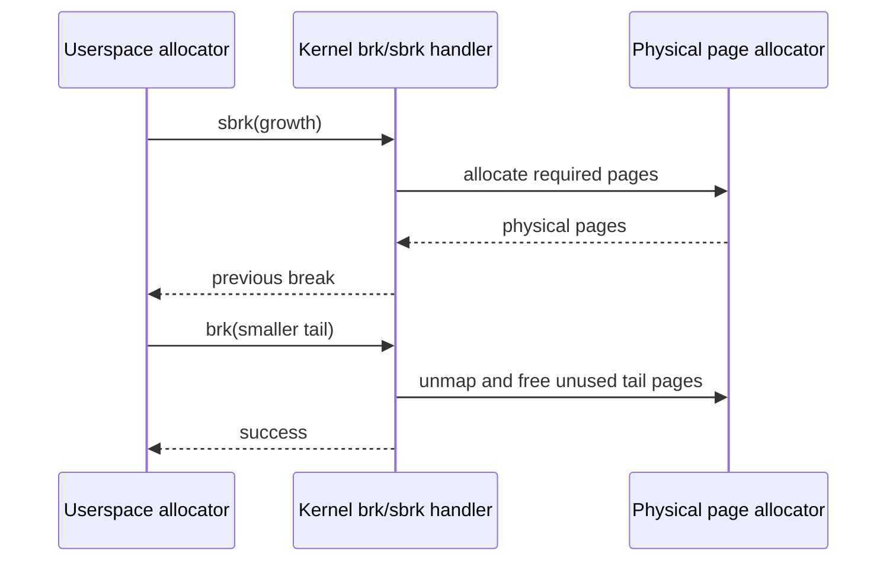
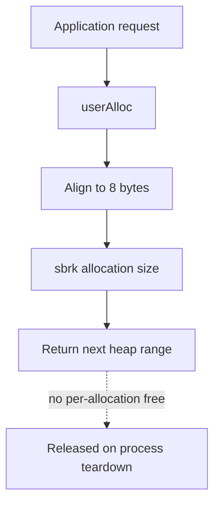
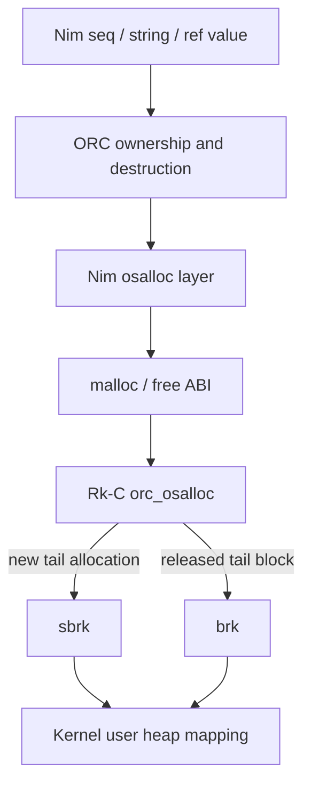
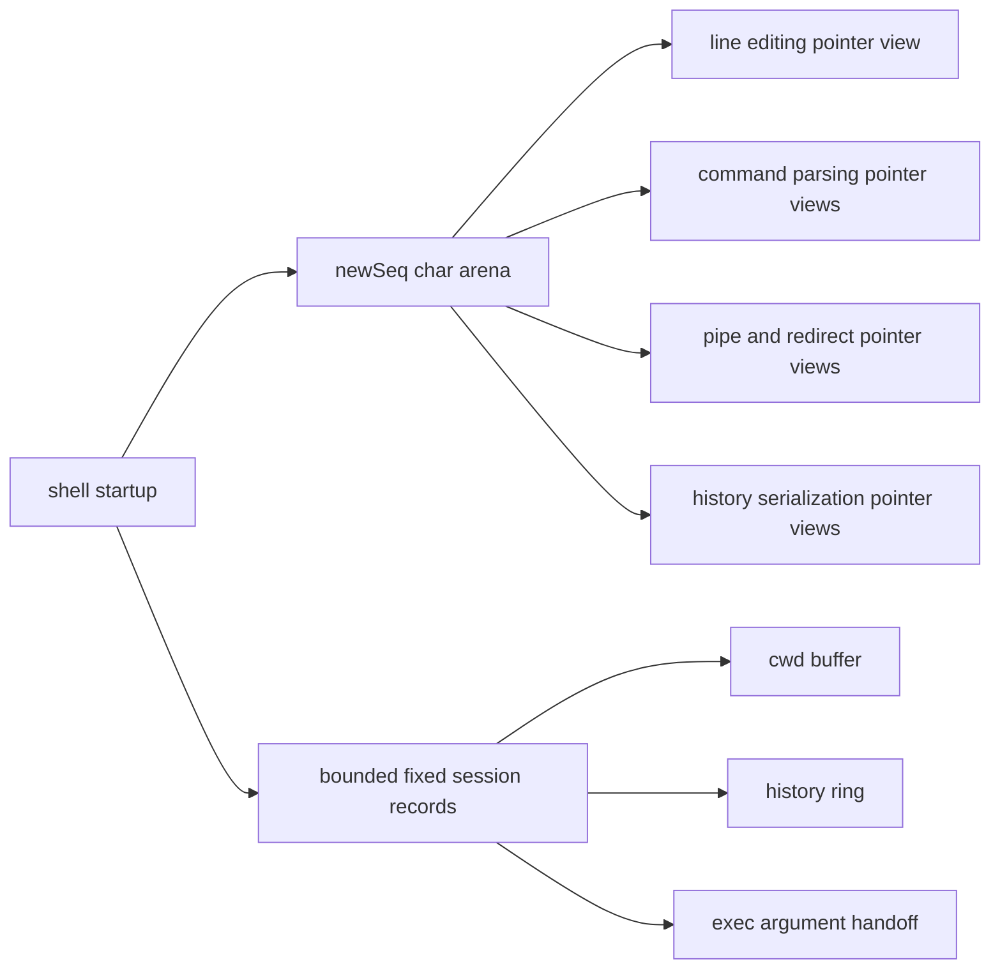

## Purpose

Rk-C userspace now has three practical storage models: fixed buffers embedded in a program image, a minimal bump allocator used to establish dynamic heap growth, and Nim ORC-managed objects backed by a custom `osalloc` bridge. These models are not interchangeable conveniences: each defines ownership, reclamation, pointer stability, and expected kernel interaction differently.

The shell is the first resident interactive program migrated to ORC-backed storage. It is a useful example because it keeps mutable state for its entire session, passes raw pointer views to existing parsing and I/O paths, and exercises pipe and redirection processing repeatedly.

## Storage Models at a Glance

| Model | Storage Source | Ownership and Lifetime | Reuse and Release | Appropriate Use |
| --- | --- | --- | --- | --- |
| Fixed buffer | RKX image data or BSS mapped at process creation | Owned by the containing process for its entire lifetime | No individual release; reclaimed when the process address space is discarded | Bounded ABI records, small stable tables, strictly limited input |
| Bump allocator | Process heap grown through `sbrk` | Allocation survives until process exit because the allocator has no `free` operation | No reuse and no heap contraction during normal execution | Heap bring-up, diagnostics, short-lived experiments |
| Nim ORC through `osalloc` | Nim managed values request memory through `malloc` and `free`, which are backed by the Rk-C process heap | Lifetime follows ORC ownership and reference counts | Freed blocks may be reused, adjacent free blocks may merge, and free tail storage may lower `brk` | Strings, sequences, reference objects, and longer-lived application state |

## Kernel Heap Contract

Every user process receives a heap interval when its RKX image is configured. The heap begins immediately after the mapped image and may grow toward the user stack, with one guard page left between the permitted heap limit and the stack region.

```text
lower virtual addresses                                             higher virtual addresses

+----------------+----------------------+--------------------+-----------+------------------+
| RKX image      | allocated heap       | unused heap window | guard page| user stack       |
| text/data/bss  | [heapStart, brk)     | [brk, heapLimit)   |           |                  |
+----------------+----------------------+--------------------+-----------+------------------+
                 ^                      ^                    ^
                 heapStart              heapEnd / brk        heapLimit
```

`brk` selects an absolute heap end and `sbrk` moves that end relative to its previous value. The kernel maps newly crossed pages as user-readable and user-writable without execute permission, and it releases pages when the break shrinks below them. All remaining image, stack, and heap pages are released when the process address space is discarded.



## Fixed Buffers

Fixed buffers are part of a program's mapped storage and need no allocator call after startup. Their best property is certainty: the address and maximum capacity remain stable for the lifetime of the process, and low-memory allocation failure cannot occur while handling an already mapped buffer.

The same certainty is also the limit. Capacity must be chosen before runtime, overprovisioning costs mapped memory for every process instance, and an input or data structure that grows beyond its bound must be rejected or truncated deliberately.

The current shell still keeps genuinely bounded session structures as fixed storage, including its current-working-directory record, its fixed-size history ring, and its execution argument handoff buffer. These records already have explicit protocol or UI limits and do not need independently managed lifetimes.

## The Bring-Up Bump Allocator

The earlier dynamic userspace path is a minimal bump allocator in the core userspace library. It obtains the initial break using `sbrk(0)`, aligns each requested allocation to 8 bytes, and advances the process break for each new allocation.



This allocator was valuable for validating the heap syscall and page-mapping path because its state transition is simple and observable. It remains suitable for `heapcheck`-style diagnostics, but it is a poor fit for resident applications: repeated temporary work permanently advances the heap until the process exits.

## Nim ORC Through `osalloc`

ORC allows Nim-managed values such as `seq`, managed strings, and `ref` objects to release backing storage as ownership disappears. In the Rk-C userspace build, an ORC-enabled binary is compiled with `--mm:orc` and `-d:nimAllocPagesViaMalloc`, so Nim's operating-system allocation layer reaches the application's exported `malloc` and `free` ABI instead of expecting a hosted operating system allocator.

The Rk-C ORC bridge supplies that ABI in `user/lib/runtime/orc_osalloc`. The allocator aligns payloads to 16 bytes, records a small block header, first reuses a sufficient free block when available, splits an oversized reusable block, and otherwise grows the process heap using `sbrk`. When `free` is called, neighboring free blocks are coalesced; if the resulting free block reaches the heap tail, the bridge reduces `brk` so the kernel can unmap and return complete trailing pages.



| Event | ORC Bridge Behavior | Kernel-Visible Result |
| --- | --- | --- |
| First allocation or no suitable free block | Append a metadata block and payload at the heap tail | `sbrk` may map additional heap pages |
| Allocation fits a released block | Reuse the block and optionally split its remainder | No heap growth is required |
| A non-tail object is released | Mark the block free and merge adjacent released blocks | Pages remain mapped because later live objects still occupy the tail |
| The free range reaches the heap tail | Remove the tail range from the allocator and lower the break | Whole pages beyond the new break can be unmapped and returned |
| The process exits | Process lifecycle cleanup releases all mappings | Any remaining allocator state disappears with the address space |

The ORC-enabled targets currently set `USER_ORC_MIN_HEAP_PAGES` to `4`, giving Nim's allocator an initial 16 KiB page request rather than its substantially larger hosted-runtime-oriented default. This is a build-time tuning value rather than an ABI promise, and it should be measured again as more applications migrate to managed storage.

The bridge also provides the small standalone runtime surface needed by Nim error handling: writes for fatal diagnostics are routed to standard error, flush is a no-op for direct descriptor writes, and a fatal runtime exit terminates the current user process.

## Shell Migration

The shell previously depended on manually managed dynamic buffers while also retaining bounded fixed session records. It is now built as an ORC-enabled user program and owns its mutable editing and command-processing workspace through one `seq[char]` arena. Creating one stable arena is intentional: existing command parsing and descriptor setup code can keep raw pointer views into its ranges without risking pointer invalidation from a later sequence resize.

```text
shellManagedStorage: seq[char] owned by ORC (5328 bytes)

+----------------------+-------+--------------------------------------------+
| Range                | Bytes | Use                                        |
+----------------------+-------+--------------------------------------------+
| line buffer          |    80 | interactive line editing                   |
| command buffer       |    80 | parsed executable command                  |
| argument buffer      |    80 | parsed argument text                       |
| path buffer          |    80 | executable/path preparation                |
| command scratch area |   880 | 11 x 80 pipe/redirection work buffers      |
| history save buffer  |  4000 | serialization and loading of 50 x 80 lines |
| history path buffer  |   128 | per-user history file path                 |
+----------------------+-------+--------------------------------------------+
| Total                |  5328 | one ORC-owned arena                        |
+----------------------+-------+--------------------------------------------+
```



This is not a requirement that every shell value become managed immediately. The migration boundary is ownership: storage that benefits from allocator lifetime management now has an ORC owner, while records with fixed external bounds remain simple fixed arrays.

## Choosing an Allocation Model

| Requirement | Preferred Model | Reason |
| --- | --- | --- |
| Fixed-size syscall or IPC record | Fixed buffer | Capacity is part of the interface and the address must stay stable |
| Early heap-path verification | Bump allocator | Minimal state makes allocation growth easy to inspect |
| Managed application strings, sequences, or reference graphs | ORC bridge | Lifetimes naturally trigger reuse and possible heap release |
| Pointer views into managed storage | ORC arena allocated once, then never resized | The managed owner retains lifetime while raw pointer addresses remain stable |
| Long-running server scratch work | ORC bridge after measurement | Temporary request data should not monotonically consume heap space |

For future migrations, a raw pointer into a `seq` is only safe while the owning sequence remains alive and its storage is not resized or replaced. An application that needs growable content and exported pointer views should either take pointer views only after final sizing or use separate stable arenas for protocol operations.

## Validation and Observability

`/bin/orccheck` exercises the userland ORC foundation: raw allocator reuse, break restoration after release, managed string growth, managed sequence growth, and managed reference-object lifetime. The shell migration is additionally covered by the existing application smoke suite, including command execution, history operations, pipeline handling, and stdout redirection.

The `ps` memory display is useful for observing the cost of an interactive shell after the migration. One normal running session reported the following entry:

```text
11      10      rkc     rkc     sleeping        user    1%      32p     /bin/shell
```

The page count is an observation rather than a constant: it includes mapped program, stack, and heap state and can vary with commands executed, allocator activity, and runtime configuration.

## Migration Checklist

1. Choose a binary whose transient or owned data benefits from reclamation rather than selecting ORC solely for uniformity.
2. Build that binary with the ORC and `nimAllocPagesViaMalloc` flags and link the `orc_osalloc` bridge.
3. Replace manual dynamic ownership with managed `seq`, string, or `ref` storage while keeping fixed ABI-shaped records bounded where appropriate.
4. Audit every pointer view into managed storage and guarantee that its owner stays live and its backing allocation is not resized during use.
5. Run focused behavior tests and observe page use during both normal execution and repeated temporary work.
6. Confirm that process exit still releases the entire user address space even when an application retains managed state until termination.

## Related Documents

- User Program Runtime and Packaging describes RKX binaries, userspace entry, and shared runtime boundaries.
- Login and Shell Session describes the interactive workflow that now uses the ORC-managed shell workspace.
- Physical Allocator and Sv39 Page Tables describes the kernel mapping layer below user heap growth.
