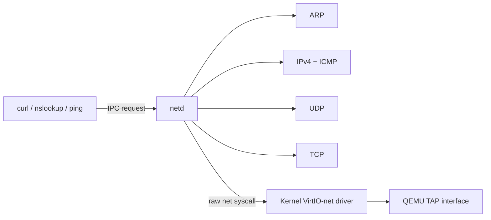

## Network Boundary

`netd` implements the protocol stack in userspace while the kernel retains restricted VirtIO-net mechanics. Applications do not read or transmit raw Ethernet frames: they use structured IPC endpoints for ping, UDP, and TCP.



`netd` is an optional managed service. A network initialization failure does not prevent local shell and filesystem operation, but network applications cannot complete requests while it is unavailable.

## Startup and Configuration

After registry ownership is visible, `netd` creates initial configuration files when absent, initializes VirtIO-net through restricted raw syscalls, and reports readiness.

| Configuration Path | Default Content |
| --- | --- |
| `/etc/resolve.conf` | `nameserver 8.8.8.8` |
| `/etc/interface.conf` | Address `10.0.1.10`, subnet `255.255.255.0`, gateway `10.0.1.1` |

The server reads the device MMIO information and MAC address after device initialization. The QEMU runtime connects VirtIO-net through the configured TAP interface so packets may leave the guest through host networking setup.

## Protocol Components

| Component | Role |
| --- | --- |
| Packet layer | Ethernet header construction and decoding |
| ARP | Resolve next-hop MAC addresses and cache the most recently resolved peer |
| IPv4 | Packet framing and checksum-oriented IP transport |
| ICMP | Echo request/reply for `ping` |
| UDP | General datagram send/receive, used by DNS and available for other applications |
| TCP | Connection handles, handshake, streaming send/receive, and close processing |

Important current transport limits are:

| Limit | Value |
| --- | ---: |
| IPC packet data payload | 512 bytes |
| Raw network packet maximum | 1514 bytes |
| TCP connection slots | 4 |
| TCP receive buffer per connection | 8192 bytes |
| Advertised TCP MSS | 512 bytes |
| TCP receive window | 4096 bytes |
| Initial TCP source port | 50000 |
| DNS source/destination port | 49152 / 53 |

## IPC Endpoints

| Client Operation | Service Processing |
| --- | --- |
| Ping request | Resolve target or gateway, send ICMP echo, return boolean result |
| UDP send | Transmit a payload to destination IP and ports |
| UDP receive | Wait for a matching datagram and return source plus payload |
| TCP connect | Complete connection establishment and return a connection handle |
| TCP send/receive | Transfer stream data through a handle |
| TCP close | Perform close handling and release the connection |

The main service loop processes pending IPC packets, drains up to 32 received raw packets in one polling pass, then sleeps for one tick. Protocol timeouts are measured in system ticks: ARP waits up to 200, ICMP up to 300, and DNS or TCP operations up to 5000.

## Higher-Level Clients

Networking libraries build reusable application-facing functions above the service protocol:

```text
curl
  -> HTTP or HTTPS URL parsing
  -> DNS A lookup when host is not an IPv4 literal
  -> TCP connection through netd
  -> optional TLS 1.3 record and handshake processing in user library
  -> HTTP request/response streaming to stdout
```

| Application | Stack Usage |
| --- | --- |
| `ping` | ICMP endpoint |
| `nslookup` | DNS carried over the general UDP endpoint |
| `tcpcheck` | TCP service validation |
| `curl` | DNS, TCP, HTTP, and optional TLS client libraries |

Keeping HTTP and TLS in reusable user libraries, rather than inside `curl` or `netd`, allows future applications to reuse transport and protocol layers without broadening the raw network privilege boundary.

## Actual DNS and HTTPS Session Output

The following actual execution result demonstrates DNS resolution and an HTTPS request. DNS result addresses may vary by resolver response. The response body is abbreviated below after the opening content.

```text
root@Rk-C:/$ nslookup example.com
Server: 8.8.8.8
Name: example.com
Address: 104.20.23.154

root@Rk-C:/$ curl -v https://example.com
TLS: TLS1.3
cipher: TLS_CHACHA20_POLY1305_SHA256
<!doctype html><html lang="en"><head><title>Example Domain</title>...
root@Rk-C:/$
```
