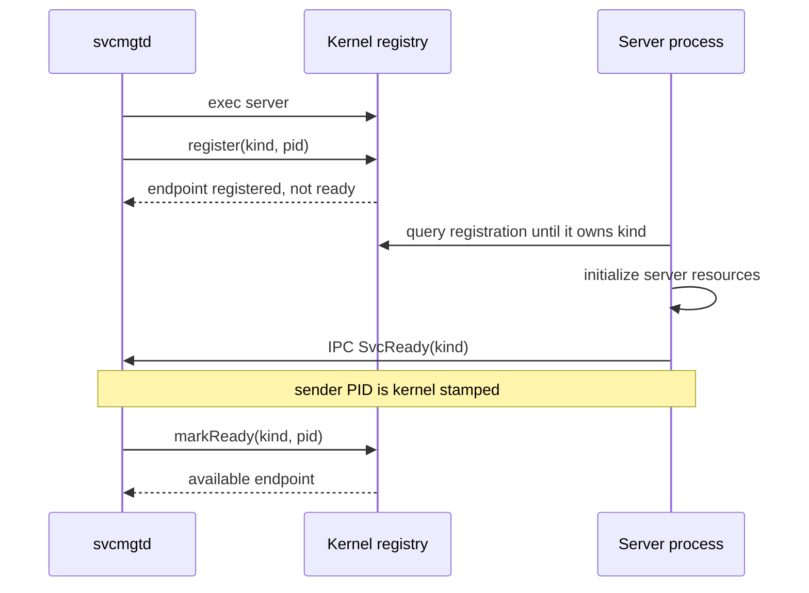

## Responsibility Split

`svcmgtd` is the userspace supervisor for long-running servers. It decides which managed services should exist and what to do when one fails. The kernel registry remains the protected routing authority: it records which PID owns a service kind and whether that endpoint has completed startup.

| Owner | Owned State |
| --- | --- |
| Kernel registry | `kind -> pid`, registered flag, ready flag, process availability |
| `svcmgtd` | Lifecycle state, deadlines, restart counts, recent event logs, administrative policy |

## Managed Servers

The supervisor starts six catalog services after registering itself as the service manager.

| Startup Order | Service | Required | Primary Role |
| ---: | --- | --- | --- |
| 1 | `procmgtd` | Yes | Process list and kill mediation |
| 2 | `blockd` | Yes | VirtIO block requests |
| 3 | `fsd` | Yes | Filesystem policy and `/proc` forwarding |
| 4 | `userd` | Yes | Identity and password database |
| 5 | `procfsd` | No | Dynamic `/proc` content |
| 6 | `netd` | No | Network protocol service |

The login session depends on required-service availability. It may still be offered in degraded mode when optional observability or networking services are not ready.

## Service Startup Handshake

Each managed server uses a registration-then-ready protocol:



Server-side startup waits up to 200 ticks to observe its registry ownership. The supervisor also gives a newly started service 200 ticks to report ready. During initial boot the kernel separately waits up to 250 ticks for required availability before moving on to login.

## Lifecycle State Machine

```text
                      start request
 stopped/degraded  --------------------> starting
      ^                                     |
      |                                     | ready packet
      | startup failure                     v
      +-------------------------------   running
      ^                                     |
      | optional failure / manual stop      | exit or liveness loss
      +-------------------------------------+

 required service failure: running -> restart -> starting
 optional service failure: running -> degraded
```

`svcmgtd` polls control messages and service liveness every 10 ticks. Availability failure must be observed three consecutive times before it is handled as an exited process. Required service failure triggers automatic restart; optional failure records a degraded state and does not restart automatically.

## Administrative Interface

The `/bin/svc` command exposes two kinds of service state:

| Command | Data Source | Meaning |
| --- | --- | --- |
| `svc list` | Kernel registry | Registered PID and current availability |
| `svc status [name]` | `svcmgtd` IPC | Lifecycle state, starts, restarts, ready tick, failure reason |
| `svc degraded` | `svcmgtd` IPC | Only degraded managed services |
| `svc logs` | `svcmgtd` IPC | Most recent service lifecycle events |
| `svc start/stop/restart` | `svcmgtd` IPC | Lifecycle mutation |

The manager keeps eight recent event records, each bounded to 96 characters. Mutation and detailed status packets are accepted only when the kernel-stamped sender UID is root and the sender has the service-manager capability. Required services cannot be manually stopped through the supervisor.

## Extending the Catalog

A future userspace server fits this design when it has:

1. A stable service kind shared by kernel and user clients.
2. A catalog entry describing its binary path and required/optional policy.
3. RKX metadata requesting only the required raw or administrative privilege.
4. A startup sequence that waits for registration, initializes, then reports ready.
5. A request protocol whose callers can detect unavailability or restart.

The split is deliberate: the kernel should add only protected routing and raw mechanism needed for the new service, while service-specific policy remains in the supervised process.

## Actual Registry and Supervisor Output

The following commands were executed from a root shell after initial service startup. `svc list` reflects kernel registry state; `svc status` includes the userspace supervisor counters and ready ticks.

```text
root@Rk-C:/$ svc list
service     pid     registered      available
svcmgtd     3       yes             yes
blockd      5       yes             yes
fsd         6       yes             yes
procmgtd    4       yes             yes
netd        9       yes             yes
procfsd     8       yes             yes
userd       7       yes             yes

root@Rk-C:/$ svc status
service     state   pid     starts  restarts        ready_tick      reason
procmgtd    running 4       1       0               2               none
blockd      running 5       1       0               6               none
fsd         running 6       1       0               9               none
userd       running 7       1       0               18              none
procfsd     running 8       1       0               22              none
netd        running 9       1       0               29              none
root@Rk-C:/$
```

Column spacing above is normalized for documentation readability; the values and rows are from an actual execution result.
