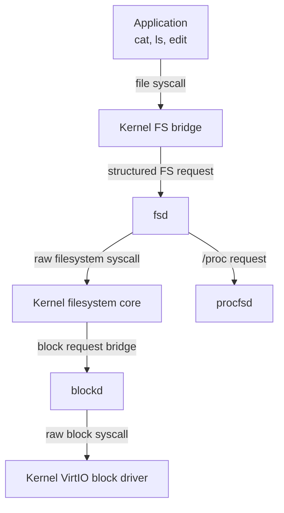

## Storage Service Chain

Rk-C separates privileged device mechanics from service-side filesystem policy. Ordinary applications call filesystem syscalls, while the kernel forwards policy operations to `fsd` once it is available. Raw storage and raw filesystem syscalls are reserved for registered servers.



## `blockd`

`blockd` is the narrow block-service endpoint. After registry confirmation it announces readiness and blocks waiting for kernel-originated block requests.

| Request Field | Purpose |
| --- | --- |
| Operation | Read or write one block |
| Block index | Target 512-byte disk sector |
| Data | One 512-byte payload for write or response data for read |

It does not implement allocation, paths, or ownership. It only translates a service request into the restricted raw block operation and replies with the result.

## `fsd`

`fsd` provides filesystem policy for applications while using kernel raw filesystem mechanisms as its backend. It receives the requesting UID and GID in each kernel-generated filesystem request, allowing newly created nodes to receive the caller identity rather than the service process identity.

| Operation Family | Service Behavior |
| --- | --- |
| Listing and reads | Read raw filesystem data, with special forwarding for `/proc` |
| Create directory | Create node, then assign request UID/GID; remove it if ownership assignment fails |
| Write new file | Write node, then assign request UID/GID when the file was newly created |
| Remove or rename | Apply raw mutation, rejecting virtual `/proc` rename targets |
| Metadata change | Apply `chmod`/`chown`, rejecting virtual `/proc` paths |

The filesystem request path is bounded to 128 bytes, and a request or response data payload is bounded to 4096 bytes. The kernel supports eight outstanding filesystem bridge requests.

Before `fsd` has ever been registered, the kernel can use raw filesystem handling to permit bootstrapping. Once a service has registered, losing that service produces failure instead of silently returning to raw handling; this makes server crashes visible and prevents an unintended policy bypass.

## `procfsd`

`procfsd` produces dynamic inspection data. It is optional, so the system can continue to supply storage and login if the process filesystem service is degraded.

At `/proc`, the service exposes eight named top-level entries:

| Entry | Reported Information |
| --- | --- |
| `uptime` | Time elapsed from tick counters |
| `meminfo` | Bitmap page allocation summary |
| `cpuinfo` | CPU/runtime information |
| `processes` | Process table views |
| `services` | Kernel registry service status |
| `traps` | Trap statistics |
| `kmsg` | Kernel message ring content |
| `fsinfo` | Filesystem statistics |

It also exposes PID directories derived from process information. Payloads flow through IPC packets of at most 512 bytes; `fsd` chunks directory enumeration and mediates `/proc` reads so applications still use normal file operations.

```text
ls /proc
  -> kernel file syscall
  -> fsd receives filesystem request
  -> procfsd supplies directory chunk(s)
  -> fsd returns regular DirEntry data
  -> ls formats output in userspace
```

## Ownership and Virtual Data

Persistent filesystem nodes retain UID, GID, and mode enforced by filesystem operations. Dynamic `/proc` nodes are synthesized as read-oriented virtual content rather than stored mutable files. In particular, `fsd` rejects rename, chmod, and chown requests directed at `/proc`, maintaining the separation between stored user data and generated diagnostic views.

## Actual Proc Filesystem Output

This actual execution result shows `procfsd`-provided entries passing through normal filesystem commands. PID directory names depend on processes alive at the time of the query, and bitmap usage changes with active commands.

```text
root@Rk-C:/$ ls /proc
uptime  meminfo cpuinfo processes       services        traps   kmsg    fsinfo  1/      11/
3/      4/      5/      6/      7/      8/      9/      10/     15/

root@Rk-C:/$ cat /proc/meminfo
total: 32767 pages
used : 1043 pages
free : 31724 pages
root@Rk-C:/$
```
