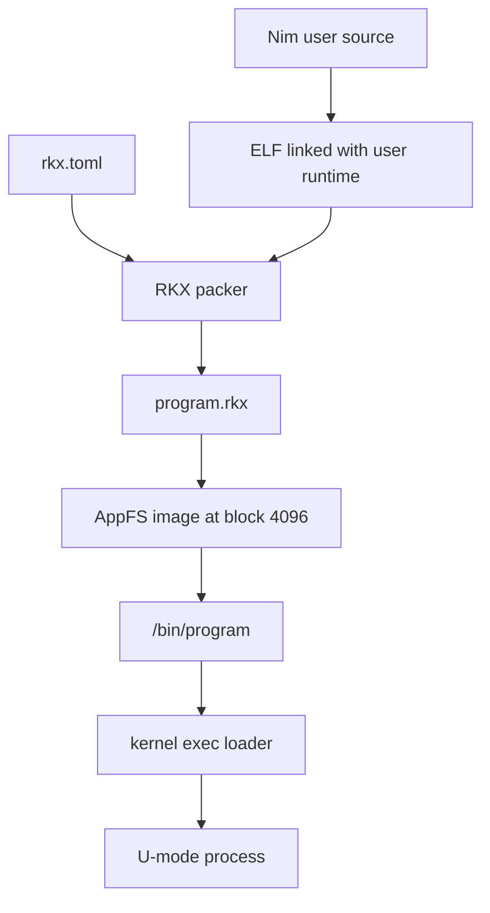

## Userspace Roles

Rk-C runs both interactive programs and system servers as U-mode processes. They share the same syscall ABI and RKX executable format, but they have different operational roles.

| Kind | Installed Examples | Responsibility |
| --- | --- | --- |
| Session programs | `login`, `shell` | Create an authenticated interactive session |
| User commands | `ls`, `curl`, `ps`, `edit`, `passwd` | Perform actions requested by the shell |
| Managed servers | `svcmgtd`, `fsd`, `netd`, `userd` | Supply long-running OS policy and services |
| Diagnostic programs | `stracectl`, `dmesg`, `rkxinfo`, checks | Observe or validate system behavior |

All packaged programs appear under `/bin`. The image builder stores RKX objects in AppFS at disk block `4096`; the filesystem layer exposes that read-only image as `/bin` after boot.

## Build and Load Path



The `Makefile` currently packages interactive commands and seven user servers: `svcmgtd`, `procmgtd`, `fsd`, `blockd`, `procfsd`, `netd`, and `userd`.

## RKX Program Contract

Each program has an RKX metadata description next to its source directory. Metadata states the requested stack size, requested privileged capabilities, and optionally the UIDs allowed to execute the program.

| Metadata Concept | Meaning |
| --- | --- |
| `schema_version` | Metadata input version consumed when producing RKX |
| `stack_pages` | User stack allocation requested for the process |
| `capabilities` | Requests to the kernel capability grant policy |
| `allowed_uids` | Execution restriction, when the list is non-empty |

Metadata is a request, not an authority. At execution time the kernel validates the RKX image, enforces execution UID restrictions, and grants only capabilities approved for trusted executable paths. For example, `/bin/svcmgtd` requests service and process management capabilities and may run only as UID `0`, while ordinary applications such as `/bin/curl` request no privileged capabilities.

## Runtime Entry and Syscalls

The user runtime supplies a minimal assembly entry point and the raw syscall transition. Nim applications expose `user_start(arg)` and call type-safe wrappers from the core syscall module.

```text
kernel exec
   |
   | entry PC + raw argument string
   v
user runtime entry.S
   |
   v
user_start("-v https://example.com")
   |
   +--> core/args parses argc/argv-style values
   +--> core/syscall places syscall number in a3 and executes ecall
```

The raw argument ABI is a single NUL-terminated string. The shared argument parser converts it into at most 16 arguments, with at most 95 visible characters per argument. Applications use this shared parser instead of inventing per-command token handling.

## Inherited Process Environment

A child application is created from its parent process environment before its program image replaces the child execution state.

| Inherited Resource | Practical Effect |
| --- | --- |
| UID and GID | Commands execute as the authenticated shell user |
| Current working directory | Relative paths are resolved by each application in the expected directory |
| File descriptors | Shell pipelines and redirection apply to every application uniformly |
| Standard descriptors | FD `0`, `1`, and `2` remain stdin, stdout, and stderr unless replaced |

This model keeps shell features independent of individual commands: a new program using stdout automatically works with `>` and a new filter using stdin automatically works in a pipe.

## Shared Userspace Libraries

Userspace libraries are split by responsibility so an application links only the functionality it imports.

| Library Area | Purpose |
| --- | --- |
| `core` | Syscalls, I/O, parsing, paths, heap, user and group record parsing |
| `ipc` | Service discovery, request/reply helpers, packet payload copying |
| `net` | IP addresses, DNS, TCP, HTTP, TLS, and cryptographic primitives |
| `runtime` | Process entry and raw syscall transition |

This division is particularly important for small RKX images: a basic file command does not need to pull the TLS or network implementation into its binary.

## Actual RKX Metadata Output

`rkxinfo` decodes an installed AppFS executable without executing it. This actual execution result demonstrates that a server image carries the requested service management privileges and root-only execution policy. Segment sizes are build-dependent.

```text
root@Rk-C:/$ rkxinfo /bin/svcmgtd
path: /bin/svcmgtd
magic: RKX1
version: 2
header_size: 184
entry: 0x1200000
capability_mask: 0x31 (sys_service_manager,sys_process_list,sys_process_kill)
text: va=0x1200000 off=184 file=13142 mem=13142
rodata: va=0x1204000 off=13326 file=1280 mem=1280
data: va=0x1205000 off=14606 file=0 mem=0
bss: va=0x1205000 mem=8636
stack_pages: 4
allowed_uids: 0
flags: 0x0
root@Rk-C:/$
```
